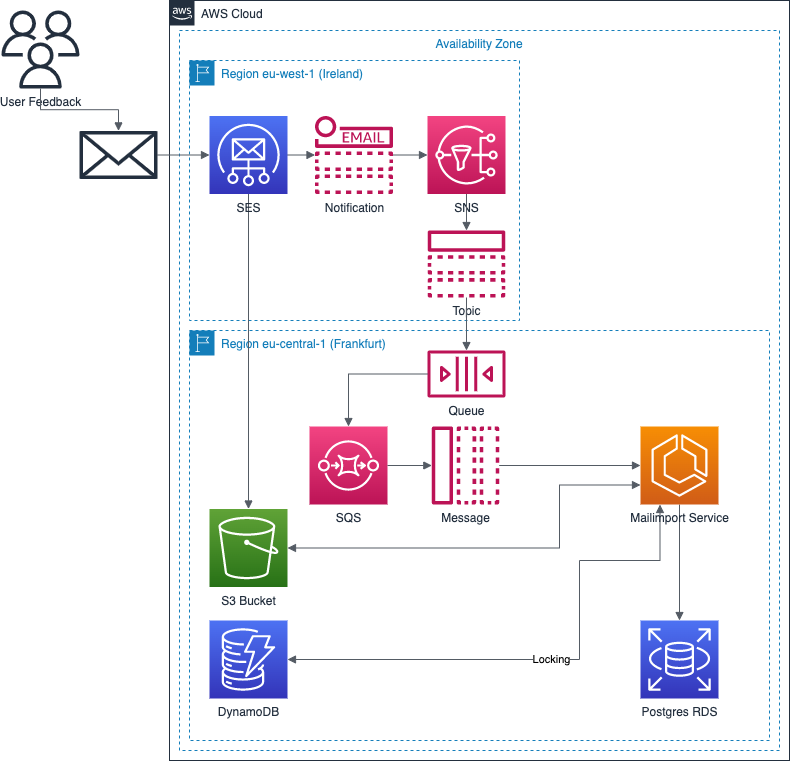

# Mailimporter

## Description
This mail importer imports incoming mails into a database

The mails were sent to an address at the Amazon [Simple E-Mail Servie (SES)](https://aws.amazon.com/de/ses/).
Incoming mails were saved to a [S3 Bucket](https://aws.amazon.com/de/s3/) and a message to a queue  ([Simple Queue Service (SQS)](https://aws.amazon.com/de/sqs/) over [Simple Notification Service (SNS)](https://aws.amazon.com/de/sns/)) is filed.
The mailimporter services subscribes to the queue and is notified when a mail arrives. The mail is read, transformed and some data will be saved to a database.

See [function diagram](src/site/doc/AWS-SES.drawio.pdf)

## Webfrontend
There is a simple web frontend to view the mails in the S3 Bucket
Es ist ein einfaches Webfrontend enthalten, um die Inhalte des S3-Buckets anzuzeigen.

